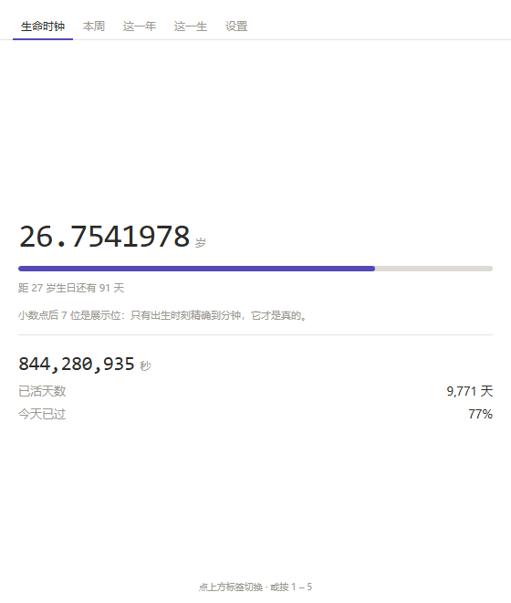
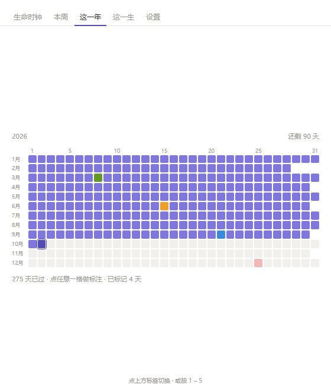
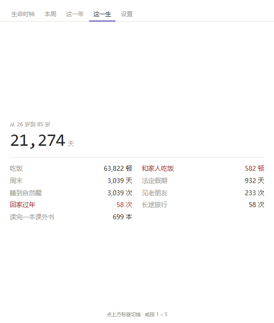
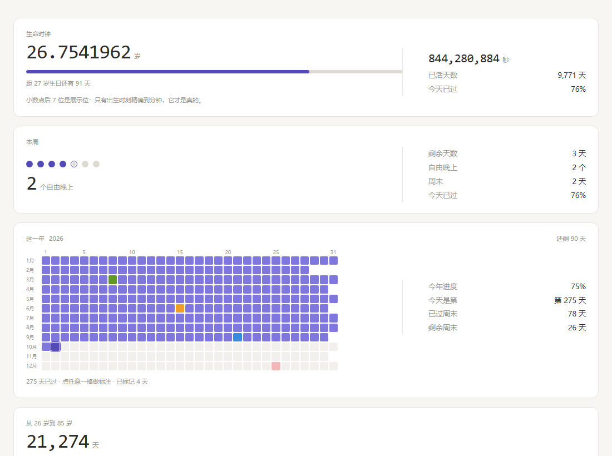

<div align="center">

# 人生余额

**把「还剩多少」摆在桌面上的一个小窗口。**

纯本地运行 · 不联网 · 不上传 · 单文件夹绿色程序

</div>

---

<div align="center">

| 生命时钟 | 这一年 | 这一生 |
|:---:|:---:|:---:|
|  |  |  |

</div>

<div align="center">



</div>

---

## English

**Life Balance** is a small Windows desktop widget that keeps the numbers you'd rather not think about in the corner of your screen: how many seconds you've been alive, how many evenings of this week are actually free, and what a whole year looks like when every day you've already spent is colored in.

- Pure HTML/CSS/JS front-end, hosted in a tiny C# + WebView2 shell (~1 MB).
- Runs **100% locally**. No network access, no telemetry, no account.
- All data stays in `%LOCALAPPDATA%\LifeBalance` on your own machine.

---

## 它是什么

一个常驻桌面的小窗口。五个标签页，按 `1`–`5` 切换：

| 标签 | 内容 |
|---|---|
| **生命时钟** | 精确到小数的年龄、今年的进度条、活过的总秒数和天数 |
| **本周** | 七个点表示周一到周日，算出这周还剩几个「自由晚上」 |
| **这一年** | 12 × 31 的格子纸，每过一天涂一格。**可以给任意一天标注颜色和备注** |
| **这一生** | 把余生换算成具体的次数——还能吃多少顿饭、见几次老朋友。指标可以自己增删改 |
| **设置** | 出生日期、算到几岁、自定义背景图 |

设计上刻意做得很克制：没有账号、没有云同步、没有排行榜。它只是安静地摆在那儿。

---

## 快速开始

> **第一次打开会怎样？** 程序不会猜你的生日。它会显示一条提示，并把页面滚到「设置」卡片（带紫色高亮），等你填上自己的出生日期。**在填充之前，页面上所有数字都是无意义的占位值。**

### 方式一：不装任何东西，直接用浏览器打开（零依赖）

双击 `preview.bat`，或者直接打开 `src/www/index.html`。

功能完全一样，数据存在浏览器的 localStorage 里。

> 想直接看小窗形态：`preview.bat widget`

### 方式二：编译成桌面程序（推荐）

双击 `build.bat`。它会自动编译并把成品放到 `人生余额\` 文件夹。

然后双击 `人生余额\人生余额.exe`。

> **注意：`www` 文件夹必须和 exe 放在一起**，程序从这里读界面。

### 方式三：打包一个能发给别人的单文件

双击 `package-share.bat`，产物在 `分享版\`。把它压缩成 zip 发给别人，**对方什么都不用装**，解压后双击即可。

> 两个脚本在编译前都会**先删掉旧的输出目录**，避免上一次的残留文件被一起打包带走。

---

## 环境要求

| 用途 | 需要什么 |
|---|---|
| 只跑浏览器版 | 任意现代浏览器，无需安装 |
| 编译桌面版 | **.NET SDK 6.0 或更高**（[下载](https://dotnet.microsoft.com/download)），仅 Windows |
| 运行桌面版 | **Microsoft Edge WebView2 运行时**。Win11 自带；Win10 通常随 Edge 一起装了，没有的话[点这里](https://developer.microsoft.com/microsoft-edge/webview2/)免费装 |
| 运行分享版 | 只有 WebView2。自带 .NET 运行时，对方不用装 SDK |

编译命令本身很简单，脚本里已经写好了：

```bash
# 小型版（依赖系统 .NET 运行时，约 1 MB）
dotnet publish src/LifeBalance.csproj -c Release -r win-x64 --self-contained false -o 人生余额

# 分享版（自带运行时，约 60 MB）
dotnet publish src/LifeBalance.csproj -c Release -r win-x64 --self-contained true \
  -p:PublishSingleFile=true -p:IncludeNativeLibrariesForSelfExtract=true \
  -p:EnableCompressionInSingleFile=true -o 分享版
```

> **装错东西的话**：只装「.NET 运行时」是不够的 —— 那是给「跑」用的，编译需要 **SDK**。如果你有 `dotnet` 命令但编译时报 `No .NET SDKs were found`，就是这种情况。两个脚本都会提前检测并给出明确提示。用 `dotnet --list-sdks` 可以自己确认：有输出才算装了 SDK。

---

## 数据与隐私

**所有数据都在你自己机器上，代码里没有任何一处发起网络请求。**

| 项目 | 位置 |
|---|---|
| 设置、标注 | `%LOCALAPPDATA%\LifeBalance\webview\`（WebView2 的 localStorage / IndexedDB） |
| 背景图原图 | 同上，IndexedDB。**不做压缩、不缩放、不重编码** |
| 窗口位置尺寸 | `%LOCALAPPDATA%\LifeBalance\window.txt` |
| 运行日志 | `%LOCALAPPDATA%\LifeBalance\log.txt` |

想彻底清空数据：删掉 `%LOCALAPPDATA%\LifeBalance` 整个文件夹即可。

> 用浏览器版的话，数据存在浏览器的 localStorage 里，位置取决于你用的浏览器。

---

## ⚠️ 已知问题（动手前请先看这一段）

### 1. Windows「智能应用控制」会拦截你自己编译的程序

如果你打开了 Windows 11 的 **智能应用控制（Smart App Control）**，编译出来的 exe 会因为**没有代码签名**而被直接拒绝运行，报错：

```
应用程序控制策略已阻止此文件  (WinError 4551)
```

**它没有「仍要运行」这个选项。** 换成 .NET 加载路径看，表现是 `FileLoadException 0x800711C7`。

这是个真实存在的坑，排查思路：

- 查开关状态：注册表 `HKLM\SYSTEM\CurrentControlSet\Control\CI\Policy` → `VerifiedAndReputablePolicyState`（`1` = 开启）
- 查拦截详情：事件查看器 → `Microsoft-Windows-CodeIntegrity/Operational`，事件 **3118 / 3077** 会写明是哪个文件、哪条策略
- **已经在策略生效前跑过的文件会被放行**，所以会出现「昨天还能跑，今天重新编译就启动不了」
- 解决办法只有两个：关掉智能应用控制（**单向操作，关掉后不重装系统无法再打开**），或者买代码签名证书

### 2. 编译前必须先完全退出程序

`dotnet publish` 覆盖正在运行的 `exe`/`dll` 会把文件写坏，之后启动直接报 `FileLoadException`。脚本里没做检测，请自己注意。

### 3. 界面文件改哪里

`src/www/index.html` 是**唯一**的界面源文件。`build.bat` 和 `package-share.bat` 都会把它复制到输出目录。

想快速试改，也可以直接改 `人生余额\www\index.html` 然后重启程序（不用重新编译），但下次编译会被 `src/www/` 覆盖掉。

### 4. 界面是外置的，不是一个文件

exe 会优先读同目录下的 `www\index.html`，找不到才用嵌在程序里的那一份。**所以分发时 `www` 文件夹不能漏。**（`package-share.bat` 已经把这一步自动化了。）

---

## 项目结构

```
life-balance/
├── src/
│   ├── LifeBalance.csproj      # 项目文件
│   ├── Program.cs              # 全部 C# 代码：窗口、托盘、WebView2 宿主
│   └── www/
│       └── index.html          # 全部界面：HTML + CSS + JS，零依赖单文件
├── docs/                       # README 用的截图
├── build.bat                   # 编译（小型版）
├── package-share.bat           # 打包（自带运行时的分享版）
├── preview.bat                 # 浏览器预览
├── LICENSE
└── README.md
```

整个项目只有 **3 个源文件**。界面全部在一个 `index.html` 里——没有构建工具、没有 npm、没有框架、没有 CDN 依赖。

---

## 二次开发

**改界面**：直接编辑 `src/www/index.html`。所有 CSS 和 JS 都内联在里面，分区块注释标好了（样式 → 结构 → 逻辑）。

**改程序外壳**：`src/Program.cs`。包含无边框窗口之外的一切——托盘图标（代码里动态画的，不需要图标文件）、窗口位置记忆、`--data` 参数、运行日志。

支持的命令行参数：

```bash
人生余额.exe                     # 默认，数据在 %LOCALAPPDATA%\LifeBalance
人生余额.exe --data D:\somewhere # 指定数据目录（做便携版或调试用）
```

环境变量：

| 变量 | 作用 |
|---|---|
| `LIFEBALANCE_GPU=1` | 启用 GPU 加速（默认关闭，见 `Program.cs` 注释） |
| `LIFEBALANCE_NOSANDBOX=1` | 加 `--no-sandbox` 启动 WebView2 |

---

## 许可

[MIT](LICENSE) —— 随便用，随便改，保留版权声明即可。

> 分发自包含版本时请注意：打包进去的 .NET 运行时是 MIT 许可（微软），WebView2 SDK 遵循[微软自己的条款](https://learn.microsoft.com/microsoft-edge/webview2/)。这两项都不影响你对本项目代码的使用。
